# Serena Rust Architecture Diagrams

## System Architecture

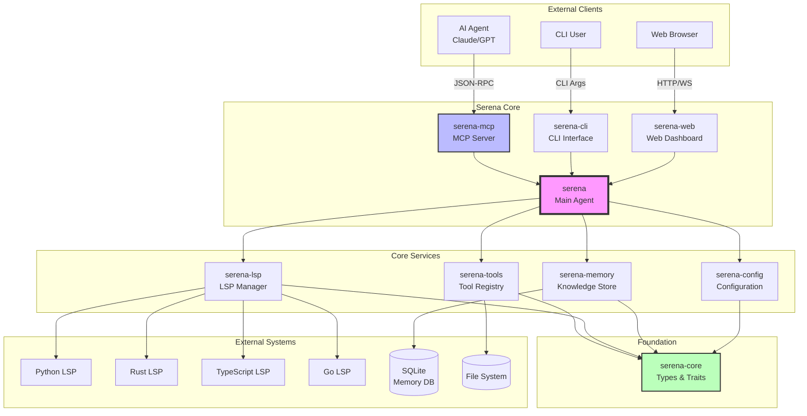

## Crate Dependency Graph

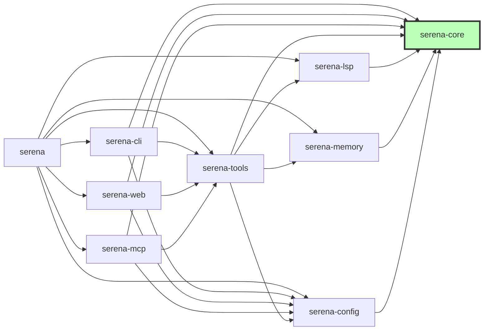

## Tool Execution Flow

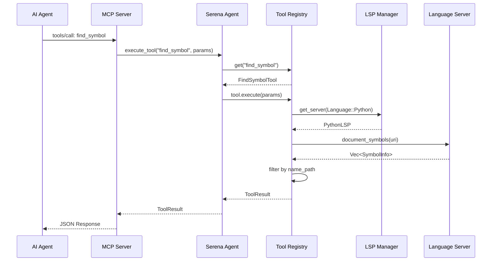

## LSP Client Architecture

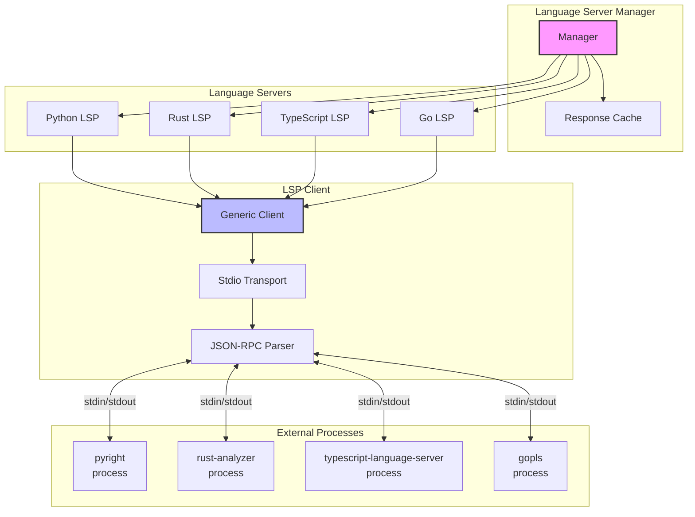

## Data Flow: File Tool Execution

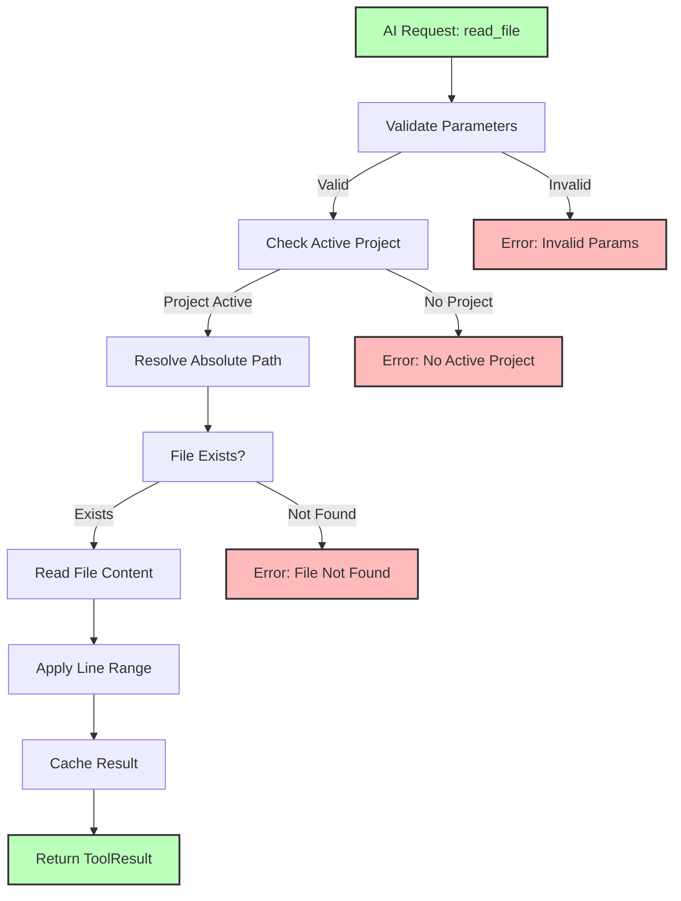

## Memory System Architecture

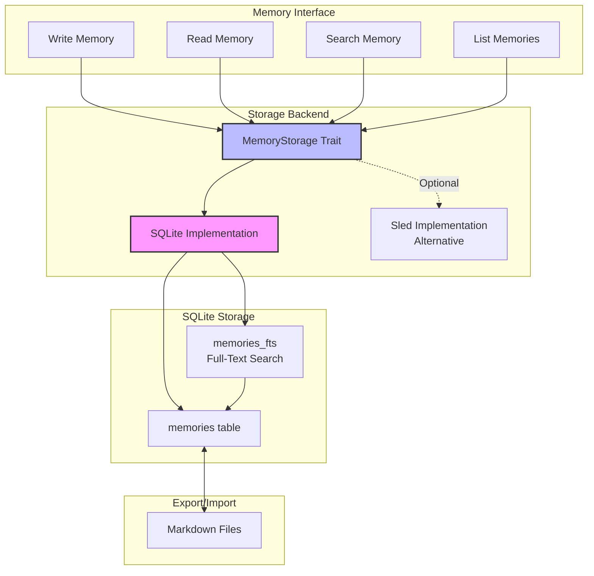

## Configuration Loading Hierarchy

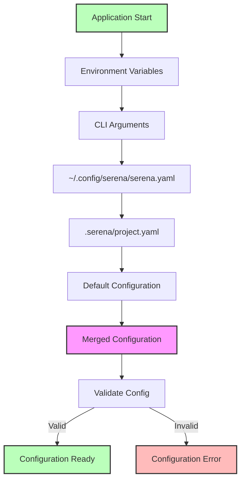

## Async Runtime Architecture

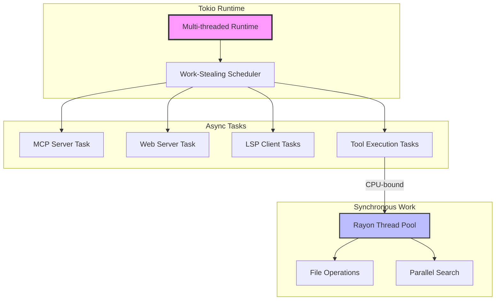

## Build and Release Pipeline

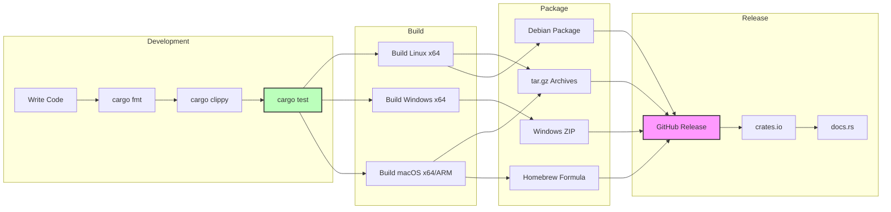

## Migration Timeline

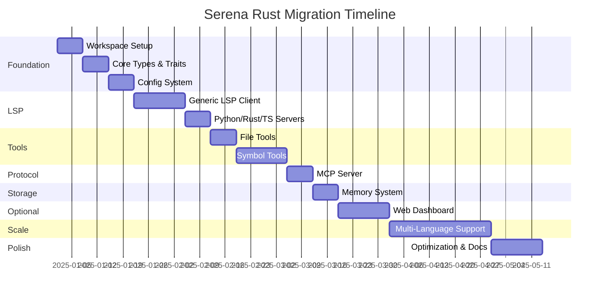

## Performance Comparison: Python vs Rust

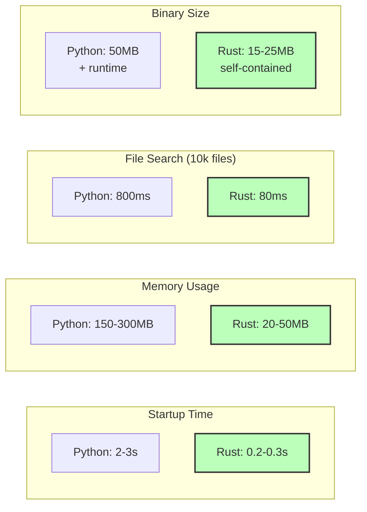

## Deployment Options

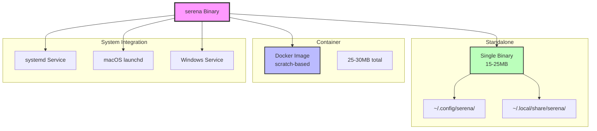
